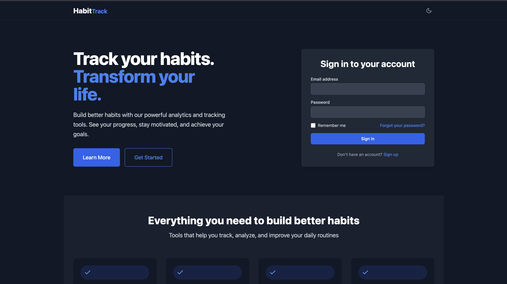

# HabitTrack - A Modern Habit Tracking Application (Next.js Version)

## Overview

HabitTrack is a Next.js-based habit tracking application that helps users build and maintain positive habits through visual progress tracking, streak monitoring, and detailed analytics. This version is built with Next.js 13+ using the App Router architecture.



## Key Features

- **Modern Architecture**
  - Built with Next.js 13+ App Router
  - Server Components and Client Components separation
  - TypeScript support
  - Tailwind CSS for styling

- **Habit Management**
  - Create, edit, and track daily/weekly habits
  - Visual progress indicators
  - Streak tracking and statistics

- **Data Visualization**
  - Interactive charts using Recharts
  - Calendar heatmap for habit completion
  - Responsive design for all devices

## Project Structure

```
habittrack/
├── .next/                # Next.js build output
├── app/                  # App Router directory
│   ├── globals.css       # Global styles
│   ├── layout.tsx        # Root layout
│   └── page.tsx          # Home page
├── components/           # Reusable UI components
├── data/                 # Mock data
│   └── mockData.ts       # Sample habit data
├── hooks/                # Custom React hooks
│   └── use-toast.ts      # Toast notifications hook
├── lib/                  # Utility functions
│   └── utils.ts          # Helper functions
├── public/               # Static assets
├── .eslintrc.json        # ESLint configuration
├── next.config.js        # Next.js configuration
├── package.json          # Project dependencies
├── tailwind.config.ts    # Tailwind CSS configuration
└── tsconfig.json         # TypeScript configuration
```

## Technologies Used

- **Core**
  - Next.js 13+ (App Router)
  - React 18
  - TypeScript

- **Styling**
  - Tailwind CSS
  - CSS Modules

- **Data Visualization**
  - Recharts
  - date-fns

- **UI Components**
  - Lucide React (icons)
  - Framer Motion (animations)

## Getting Started

1. Clone the repository:
   ```bash
   git clone https://github.com/yourusername/habittrack-nextjs.git
   cd habittrack-nextjs
   ```

2. Install dependencies:
   ```bash
   npm install
   ```

3. Start the development server:
   ```bash
   npm run dev
   ```

4. Open your browser to `http://localhost:3000`

## Development Scripts

- `npm run dev` - Start development server
- `npm run build` - Create production build
- `npm run start` - Start production server
- `npm run lint` - Run ESLint
- `npm run format` - Format code with Prettier

## Configuration

The application can be configured through these files:

- `next.config.js` - Next.js configuration
- `tailwind.config.ts` - Tailwind CSS customization
- `tsconfig.json` - TypeScript settings

## Data Management

The application currently uses mock data located in `data/mockData.ts`. To connect to a real backend:

1. Create API routes in `app/api/`
2. Replace mock data calls with fetch requests
3. Implement authentication if needed

## Contributing

Contributions are welcome! Please follow these guidelines:

1. Fork the repository
2. Create a feature branch (`git checkout -b feature/your-feature`)
3. Commit your changes (`git commit -m 'Add some feature'`)
4. Push to the branch (`git push origin feature/your-feature`)
5. Open a Pull Request

## License

This project is licensed under the MIT License - see the [LICENSE](LICENSE) file for details.

## Future Improvements

- [ ] Implement user authentication
- [ ] Add database integration
- [ ] Create mobile app version
- [ ] Add social sharing features
- [ ] Implement push notifications

## Contact

For questions or feedback, please contact neogsuvam@gmail.com.
